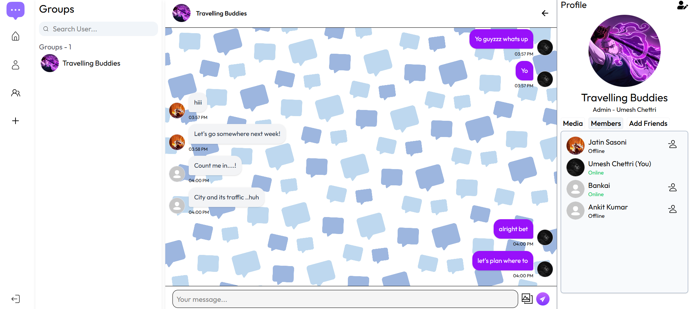
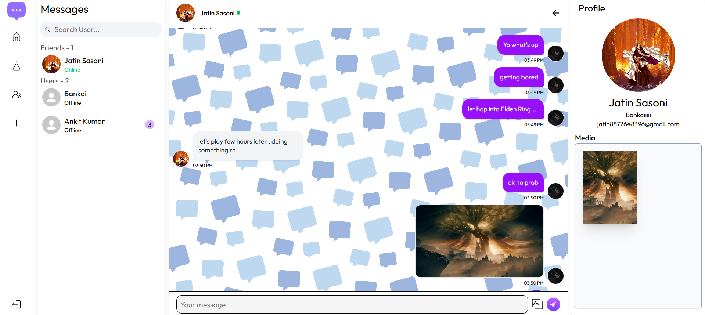

# QuickChatPro 🚀

A real-time chat application built with the **MERN stack (MongoDB, Express.js, React, Node.js)** and **Socket.io**. Engage in seamless 1:1 or group conversations, real-time messaging, and stay connected with friends.

---

## 🌐 Live Preview

> ⚠️ **Important:**  
> The backend is hosted on **Render**, which suspends the server when idle.  
> 👉 Please **first visit the backend URL** below to wake up the server (this may take a few seconds):

🔗 **Backend API (wake up server first):**  
[https://chatapp-0har.onrender.com/api/v1/user/check/isLive](https://chatapp-0har.onrender.com/api/v1/user/check/isLive)

🔗 **Frontend:**  
[https://quickchatpro.netlify.app](https://quickchatpro.netlify.app)

> 🐢 **Note:** The application may respond slowly due to **Render’s free-tier resource limits**.

## 📸 Screenshots:




## 📌 Features

- 🔒 **User Authentication** (JWT + Secure Cookies)
- 💬 **Real-Time Messaging** with Socket.io
- 🗂️ **Chat Rooms & Private Messaging**
- 🖼️ **Image Sharing in Messages**
- 🟢 **Online/Offline User Status**
- 🧑‍🤝‍🧑 **Friend Requests & Management**
- 🕒 **Message Timestamps**
- 📱 **Responsive Design (Mobile & Desktop)**

## Tech Stack

**Client:** React, Redux, TailwindCSS, React router, React hook form ...

**Server:** Node, Express...

---

| Frontend         | Backend           | Real-Time | Database                       |
| ---------------- | ----------------- | --------- | ------------------------------ |
| React.js         | Node.js           | Socket.io | MongoDB                        |
| Redux            | Express.js        |           | Mongoose                       |
| Tailwind CSS     | JWT               |           | Cloudinary (for image uploads) |
| react-hook-form  | bcryptjs          |           |                                |
| react-icons      | express-validator |           |                                |
| react-responsive | nodemailer        |           |                                |
| react-hot-toast  | jsonwebtoken      |           |                                |
| axios            |                   |           |                                |

---

## ⚡Getting Started

### Prerequisites

- Node.js
- MongoDB instance (local or Atlas)
- Cloudinary account for image uploads (optional)

---

### 🔧 Backend Setup

```bash
cd server
npm install
```

### Create a .env file in /server:

```bash
PORT=8000
MONGODB_URI=your_mongodb_uri
SECRET_KEY=your_jwt_secret
CLOUD_NAME=your_cloudinary_name
CLOUDINARY_API_KEY=your_cloudinary_api_key
CLOUDINARY_API_SECRET=your_cloudinary_api_secret
```

#### Run the server:

```bash
npm run dev
```

### 🎨 Frontend Setup

```bash
cd client
npm install
npm run dev
```

Update the frontend .env to point to your backend:

```bash
VITE_API_BASE_URL=http://localhost:8000/api/v1
```

### 🚀 Deployment

Frontend: Deployed on Netlify

Backend: Deployed on Render

### 🧩 Folder Structure

- /frontend => React frontend
- /Server => Node.js + Express backend

### ✅ Future Improvements

- ✅ Read Receipts
- ✅ Message Deletion/Editing
- ✅ Push Notifications
- ✅ Typing Indicators

## 📬 Dev?

### Jatin Sasoni :)
